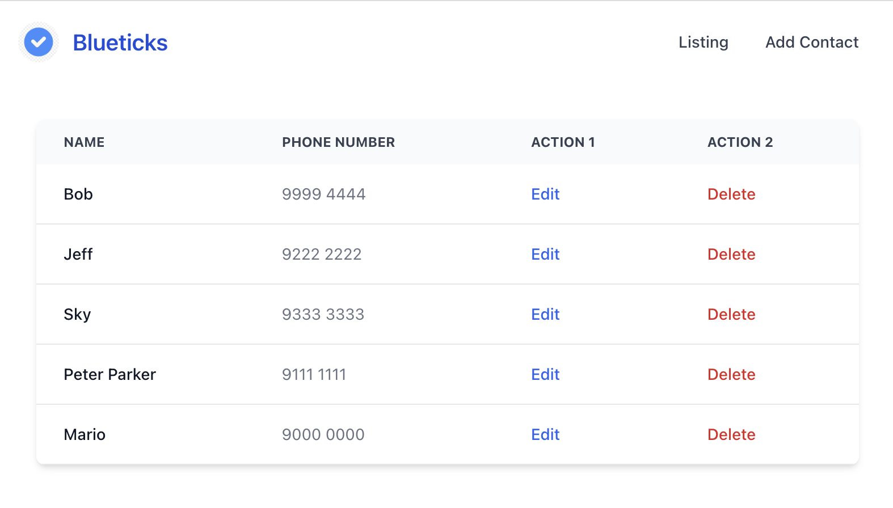
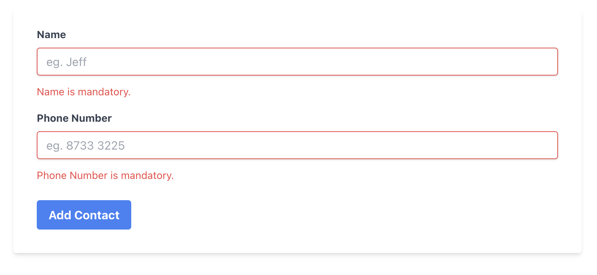

# 😀 Welcome to [Blueticks](https://blueticks.onrender.com/) by Darren Chua

This is a revamp Blueticks project from React + Django (Fullstack) to React + Firebase (Frontend) only to demonstrate live React application using CRUD with validations.

*Preview 1: Home page, listing contact numbers:*

*Preview 2: Add contact page, with Validations:*

You can visit the full-stack code here: [Blueticks (Full Stack)](https://github.com/DarrenJosiah/Blueticks). Description: React (Tailwind CSS) and Python Django full stack app with CRUD. A phonebook management system. Learnt and built in 7 days. Demo video here: https://drive.google.com/file/d/1lLbLBvwLjLONng44eoZf9nTt9_se0riI/view?usp=sharing